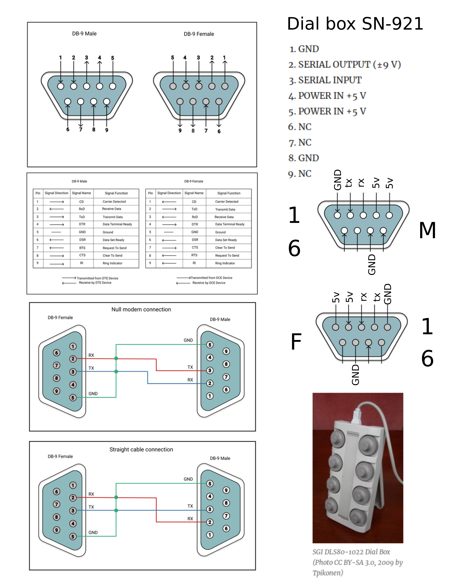

# DialBox

This is a small project to work on an esoteric dial box that was recovered from
the psychology building at FSU.

The dial box has a single wiki-page with some information on the connection. 

[Dial boxes @ yehar.com](http://yehar.com/blog/?p=3471)

A webarchive page is [here](https://web.archive.org/web/20190619162708/http://yehar.com/blog/?p=3471) -just in case

and there is another wikipedia page that sports the same images and includes
some links to bits of code that will run the dial box.

I traced down the datasheet for the rs232driver in case i decide it will be easier to 
bypass the rs232 chip and hook up to 5v logic.  [LT10801fe Rs232 Driver](lin_tech_rs232_driver_LT10801fe.pdf)

[Wikipedia](https://en.wikipedia.org/wiki/Dial_bo)

I was interested in (and copied) the python code located in the wayback
machine here -->  [Python Script](https://web.archive.org/web/20071001121945/http://www.ysbl.york.ac.uk/~emsley/coot/mbox-2004-2005/att-0547/eventio.py)

There is also an SGI dial box pinout located at [SGI dial box](https://web.archive.org/web/20071016051441/http://www.meadow.net/pinouts.html#sgidbox)

### SGI Dialbox to O2/Octane/etc Female DB9 to Female DB9. Contributed by Alvaro Moron Alonso, alvarom@madrid.sgi.com
 
o2 (female) | Dial Box (female)
---------   |  ----------
1 (DCD) | 8  (DCD)
2 (RD)  | 3  (RD)
3 (TD)  | 2  (TD)
5 (SG)  |   (GND)
7 (RTS) | 4 (RTS)
8 (CTS) | 5 (CTS)                                   

Here is an info page that I ak keeping to get this project working.
-This document is purely for educational purposes, the current images are
from an educational page located at [Virtual Serial Port](https://www.virtual-serial-port.org/article/what-is-serial-port/rs232-pinout/)

